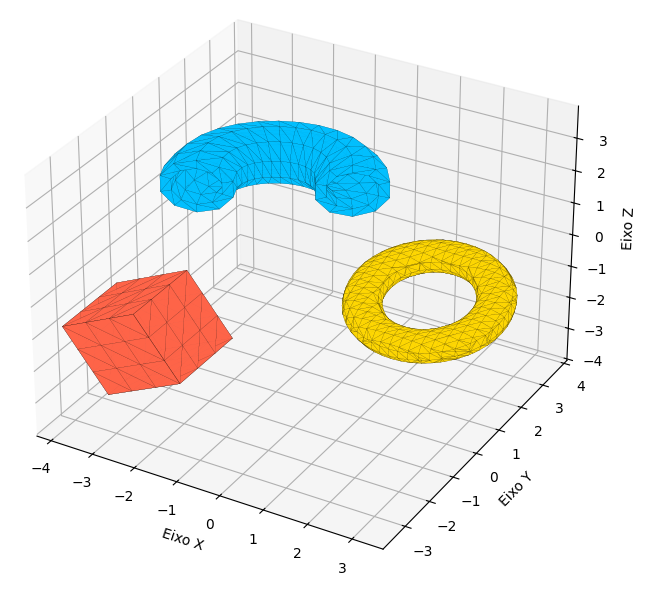
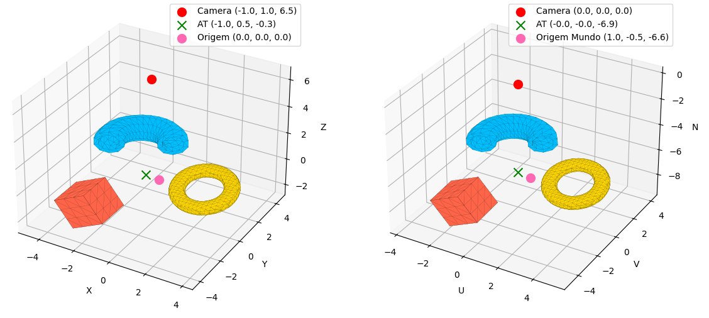
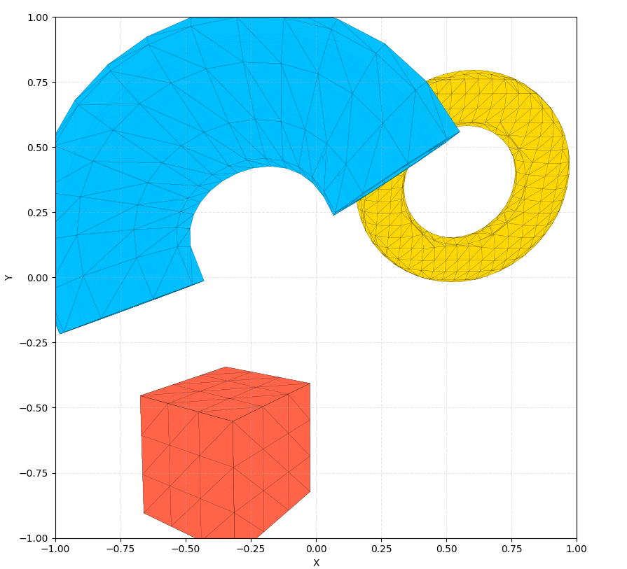
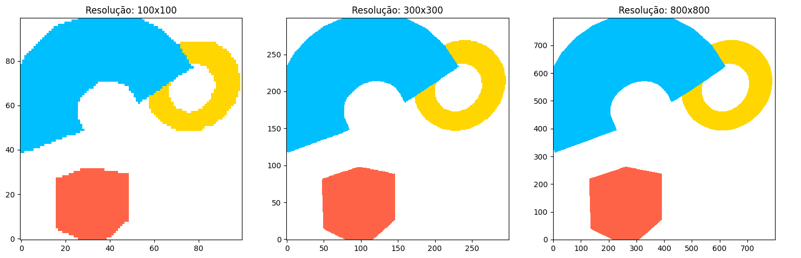

# Pipeline Gráfico 3D


Implementação de um pipeline gráfico 3D abrangendo modelagem, transformações geométricas, projeção e rasterização. Desenvolvido em Python com bibliotecas de processamento numérico e de imagem.

---

## Resultados Visuais

### 1. Sistema de Coordenadas do Mundo
Visualização dos sólidos (Cubo, Toro e Cano) posicionados no espaço global após aplicação de transformações afins.

<p align="center">
  
</p>

### 2. Sistema de Coordenadas da Câmera
Comparativo entre a cena original e a visualização transformada para o espaço do olho (vetores UVN).

<p align="center">
  
</p>

### 3. Projeção em Perspectiva
Projeção dos objetos 3D no plano 2D (NDC).

<p align="center">
  
</p>

### 4. Rasterização
Conversão da geometria vetorial em fragmentos utilizando algoritmo scanline em múltiplas resoluções.

<p align="center">
  
</p>

---

## Configuração do Ambiente

### 1. Ambiente Virtual

**Windows:**

```bash
python -m venv venv
.\venv\Scripts\activate

```

**Linux / macOS:**

```bash
python3 -m venv venv
source venv/bin/activate

```

### 2. Dependências

```bash
pip install -r requirements.txt

```

---

## Execução

Execute os comandos a partir da raiz do projeto, utilizando a flag `-m` para resolução de módulos.

### Sintaxe

```bash
python -m app.<modulo>

```

### Exemplos

* **Cena no Mundo:** `python -m app.scm`
* **Câmera:** `python -m app.scc`
* **Projeção:** `python -m app.projecao`
* **Rasterização:** `python -m app.rasterizacao`
* **Sólidos:**
* `python -m app.solidos.cubo`
* `python -m app.solidos.toro`
* `python -m app.solidos.cano`